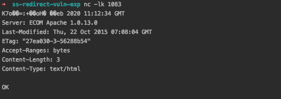
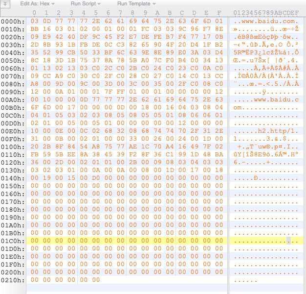

# shadowsocks redirect attack exploit

本文参考 https://github.com/edwardz246003/shadowsocks ，由于作者给出的代码过少，于是我将作者描述的攻击方式用代码写出来，更加通俗易懂。

## 情景：

- server: 127.0.0.1:1081
- client: 127.0.0.1:1080
- 攻击者可以监听 client 和 server 之间的加密流量，并且可以给 server 发包。

## 情景1：针对 IP 直连的攻击

浏览器使用 socks5 代理，通过 client 去访问 a.baidu.com 的 IP 地址，攻击者拿到加密的返回包，可以破解httpResponse内容（大部分内容）。

1. 启动 `ssserver`， `python3 myserver.py`；启动`sslocal`，`python3 myclient.py`；
2. 开启 wireshark，使用curl发包 `curl --socks5 127.0.0.1:1080 http://a.baidu.com`，收到返回 "OK"，保存为 `ss_ip_direct.pcapng`
3. 攻击者监听 `127.0.0.1:1083`
4. 攻击者解析 `ss_ip_direct.pcapng`中的返回包，篡改头部，将目标地址从 baidu的 IP 写为 `127.0.0.1:1083` 篡改后发给 1081
5. 恶意头部会让 1081 将数据解密，发送给 `127.0.0.1:1083`（或者任意指定的 IP 和 port）

**默认 ssserver 不会发数据给127.0.0.1:1083，需要临时将`_create_remote_socket`下面这段检查 patch 掉！或者把目标改成一台公网 IP 和端口** 

```
#        if self._forbidden_iplist:
#            if common.to_str(sa[0]) in self._forbidden_iplist:
#                raise Exception('IP %s is in forbidden list, reject' %
#                                common.to_str(sa[0]))
```

为了方便读者复现，已经抓到一组包，只需要执行下方三句代码即可：

`python3 myserver.py` 启动 ssserver

`nc -lk 1083` 监听1083端口

`python3 ip_direct_attack.py` 读取密文，篡改密文，发送给 ssserver

之后观察 1083，会出现下图的样子



## 情景2：针对域名访问的攻击

浏览器使用 socks5 代理，通过 client 去访问 a.baidu.com 的 域名 地址，攻击者拿到加密的请求包，可以破解httpRequest内容（大部分内容）。

1. 启动 `ssserver`， `python3 myserver.py`；启动`sslocal`，`python3 myclient.py`；
2. 开启 wireshark，使用Safari浏览器挂个代理，收到返回 "OK"，保存为 `ss_domain.pcapng`
3. 攻击者监听 `127.0.0.1:1083`，并且申请域名 `a.baidu.abc`，指向自己的服务器；（本文为了演示，在 localhost 里干了这件事）
4. 攻击者解析 `ss_domain.pcapng`中的请求包，篡改头部，将`a.baidu.com`改为`a.baidu.abc`，篡改后发给 1081
5. 恶意头部会让 1081 将数据解密，发送给 `a.baidu.abc:1083`（或者任意指定的域名和 port）

**默认 ssserver 不会发数据给127.0.0.1:1083，需要临时将`_create_remote_socket`下面这段检查 patch 掉！或者把目标改成一台公网 IP 和端口** 

为了方便读者复现，已经抓到一组包，只需要执行下方四句代码即可：

`127.0.0.1 a.baidu.abc` 加入 hosts

`python3 myserver.py` 启动 ssserver

`nc -lk 1083` 监听1083端口

`python3 domain_attack.py` 读取密文，篡改密文，发送给 ssserver

之后观察 1083，会出现下图的样子


## 情景3：针对 https 的攻击（理论可行，未实现）

对于 https 的请求，攻击者有能力知道域名，无法知道传输内容，原理和情景二相同，数据包如下图




## 详细分析见博客

https://leadroyal.cn/?p=1036
